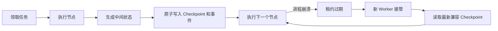

# 一篇文章带你搞懂 Checkpoint

> 当 AI Agent 从“回答一个问题”走向“连续工作几十分钟”，真正困难的事情就不再只是让它更聪明，而是让它在中断、崩溃和重试之后，仍然知道自己做到哪里，并且不会把已经完成的操作再做一遍。

## 先想象一个真实场景

你让一个基金研究 Agent 完成下面的任务：

1. 查询基金的历史净值；
2. 计算收益、波动率和最大回撤；
3. 搜索公告与研究资料；
4. 交叉验证数据；
5. 生成带引用的研究报告。

前三步已经执行完，Agent 正准备生成报告，服务却因为发布、断网或机器故障退出了。

如果系统没有 Checkpoint，重启后通常只有两个选择：要么把整个任务判为失败，要么从第一步重新执行。前者浪费已经完成的工作，后者不仅浪费时间和 Token，还可能重复调用外部接口，甚至产生重复通知、重复导出等副作用。

Checkpoint 要解决的，正是这个问题：**把一次长任务变成可以暂停、恢复和安全重试的任务。**

---

## 一、Checkpoint 到底是什么？

Checkpoint 通常译为“检查点”。它是在一个可恢复的边界上，将后续执行所依赖的状态持久化下来。

程序恢复时，不必重新走完整条路径，而是读取最近一个有效检查点，从它后面的步骤继续。

可以把它理解成游戏存档，但这个比喻还不够完整。游戏存档一般只关心“角色现在在哪里”，Agent 系统还需要知道：

- 当前执行的是哪一个任务；
- 哪些节点已经完成，下一个节点是什么；
- 已经拿到了哪些中间结果和证据；
- 哪些工具已经调用过；
- 谁拥有当前任务的执行权；
- 当前状态由哪个工作流和模型版本产生。

因此，一个更准确的表达是：

> **Checkpoint = 可恢复状态 + 执行位置 + 一致性边界。**

三者缺一不可。

只保存状态、不保存执行位置，恢复后不知道该往哪里走；只保存执行位置、不保存中间结果，会被迫重做前面的计算；如果没有一致性边界，则可能出现“工具已经执行成功，但检查点还没有写入”的尴尬状态。

## 二、Checkpoint 不是只有一种

很多介绍会把 Checkpoint 说成“把所有内存完整保存下来”。这只是其中一种实现。现实中的 Checkpoint 至少可以分成四层。

| 层次 | 保存什么 | 适合什么场景 | 代价 |
| --- | --- | --- | --- |
| 对话级 | 消息、工具调用及结果 | 恢复聊天和推理上下文 | 最低，但无法还原操作系统状态 |
| 应用级 | 状态机、DAG 节点、中间结果、游标 | 工作流、审批、长任务 | 可控，需要业务设计 |
| 文件系统级 | 文件内容或磁盘块差异 | 编程 Agent、数据处理沙箱 | 存储和恢复成本更高 |
| 进程/环境级 | 内存页、进程树、文件描述符、网络状态等 | 沙箱迁移、故障恢复、并行分支 | 能力最完整，工程成本最高 |

所以，“一个合格的 Checkpoint 必须同时保存对话、文件、进程和环境”并不总是成立。正确的问题不是“存得够不够多”，而是：

> **恢复后的下一步，依赖哪些状态？**

对于只调用数据库的业务工作流，保存任务状态和幂等键可能已经足够；对于会安装依赖、启动服务和修改文件的编程 Agent，仅保存对话显然不够。

## 三、为什么有序日志往往比一张最终快照更有价值？

快照像照片，日志像录像。

一张快照可以告诉我们“现在是什么状态”；有序事件则能说明“系统为什么会走到这里”。例如：

```text
run.started
plan.validated
task.nav-query.completed
task.metrics.completed
approval.requested
approval.granted
report.completed
```

这条时间线至少带来四个好处：

1. **恢复**：确定最后一个成功边界，跳过已经完成的步骤；
2. **审计**：解释报告的数据从哪里来、哪个工具在何时被调用；
3. **调试**：区分“模型做错决定”和“工具执行失败”；
4. **重放**：在不重复外部副作用的前提下，重新构建派生状态。

不过，日志和快照并不是二选一。成熟系统通常同时使用两者：快照负责快速恢复，事件日志负责解释、校验和重建。只存日志，恢复时间可能越来越长；只存快照，又会丢失因果链。

## 四、一次可靠的恢复是怎么发生的？

一个典型的 Agent 恢复流程如下：



这里有几个容易被忽视的关键点。

### 1. Checkpoint 必须落在稳定边界上

最好在节点成功之后保存，而不是在节点执行到一半时随意序列化内存。节点边界越清晰，恢复语义越容易验证。

### 2. 状态和位置必须一起保存

除了中间结果，还要保存当前节点和下一节点游标。否则即使恢复了数据，也可能重新执行刚完成的工具。

### 3. 恢复必须有版本约束

假设昨天的工作流是 `查询 → 分析 → 报告`，今天发布后变成了 `查询 → 校验 → 分析 → 报告`。旧 Checkpoint 如果被新图直接读取，节点含义和状态结构可能已经不兼容。

因此，检查点通常需要绑定 `graphName + graphVersion`。版本不匹配时应拒绝盲目续跑，转而执行迁移、重新规划或从安全边界重启。

### 4. “能恢复”不等于“能重复执行”

读取数据通常可以安全重试，但支付、发邮件、推送通知等操作不能简单重放。工程上需要配合：

- 幂等键，确保同一动作只生效一次；
- Transactional Outbox，让业务状态与“待发布事件”在同一个本地事务中提交，再由后台可靠投递；
- Saga 或补偿动作，处理已经发生的外部副作用；
- 人工审批，在高风险动作之前建立明确边界。

Checkpoint 负责恢复内部执行状态，却不能让已经发送的邮件“回到未发送”，也不能凭空撤销第三方系统里的支付。

## 五、主流 Agent 如何处理 Checkpoint？

### Claude Code：面向会话的代码回退

Claude Code 会在每个新回合开始前捕获代码状态，并把检查点与会话一起保存。使用 `/rewind` 可以选择恢复代码与对话、只恢复对话，或者只恢复代码。

这个机制非常适合交互式编程，但边界也很明确：官方文档说明，它跟踪的是 Claude 文件编辑工具产生的修改；通过 Bash 命令造成的文件变化、部分后台子 Agent 修改、符号链接和硬链接并不一定能被恢复。因此它是便捷的会话级保护，不是完整的机器快照，也不能替代 Git。[Claude Code Checkpointing 文档](https://code.claude.com/docs/en/checkpointing)

### Codex：持久化线程与 Git 差异管理

Codex 把线程、轮次和工具结果持久化，使任务可以被读取、恢复或从某个历史位置派生新线程；在代码侧，桌面应用的 Review 面板基于 Git diff 工作，可以按整个差异、文件或变更块暂存和还原修改。

这两个能力需要分开理解：恢复线程是在恢复 Agent 的会话记录，Git 还原是在处理工作区文件。当前官方文档并未把它描述成一个同时恢复对话、文件系统和进程的统一环境级 Checkpoint。[Codex App Server](https://developers.openai.com/zh-Hans/docs/app-server) · [Codex 代码审查与还原](https://developers.openai.com/zh-Hans/docs/code-review)

Codex CLI 曾实验过用 Git “ghost commit”记录每轮工作区快照，但历史实验实现不应被当作当前产品能力的稳定承诺。讨论 Checkpoint 时，最好区分当前公开接口、实验功能和已经移除的历史方案。

### LangGraph：保存图状态，而不是保存整台机器

LangGraph 会通过 checkpointer 保存线程内的图状态，用于会话连续性、人工介入、时间旅行和故障恢复；跨线程的用户偏好或长期事实则交给 store。它清楚地区分了短期工作流状态与长期记忆。

开发环境可以使用内存或 SQLite，生产环境通常使用 PostgreSQL。这里保存的是图执行状态，不是文件系统或进程镜像。[LangGraph Persistence 文档](https://docs.langchain.com/oss/python/langgraph/persistence)

### Devin 与 blockdiff：从文件级走向磁盘块级

Cognition 开源的 [blockdiff](https://github.com/CognitionAI/blockdiff) 使用 Copy-on-Write 文件系统元数据生成块级差异，目标是避免为磁盘镜像逐字节扫描和保存全部内容。它适合虚拟机磁盘和稀疏文件：基础镜像保持不变，检查点只记录变化的数据块。

公开仓库能够确认 blockdiff 的块级差异与 CoW 设计，但一些流传很广的具体 Devin 内部架构和性能数字并没有在该仓库中完整给出。技术写作中应把“公开可验证的机制”和“未经一手资料确认的产品细节”分开。

### CRIU：把运行中的进程冻结下来

CRIU 是 Linux 上的进程级 Checkpoint/Restore 工具。它能够采集进程树、内存映射、文件描述符等状态，并在恢复阶段重建进程树和资源；已建立的 TCP 连接也有专门的修复机制和使用约束。

这类方案能力强，但不是按一下按钮就能无条件恢复一切。外部设备、共享文件锁、网络对端和进程之外的资源都可能破坏一致性。[CRIU Checkpoint/Restore 设计](https://criu.org/Checkpoint/Restore)

## 六、为什么不能每一轮都做完整快照？

最简单粗暴的方案，是 Agent 每执行一轮就保存整个沙箱。它恢复最完整，却会造成大量无意义的 I/O。

2026 年的 Crab 论文把问题概括为“Agent 与操作系统之间的语义鸿沟”：Agent 框架知道自己调用了什么工具，却不一定知道这些工具对操作系统产生了什么影响；操作系统能看见文件和进程变化，却不知道这些变化对任务是否重要。

Crab 用 eBPF 观察每轮的文件系统、进程和内存变化，再决定跳过、只保存文件系统、只保存进程，还是做完整 Checkpoint。论文实验中，超过 75% 的 Agent 轮次没有产生恢复所需的状态变化；在部分负载上，最多 87% 的轮次可以跳过 Checkpoint。它把恢复正确率从仅保存对话时的 8% 提升到 100%，同时将运行开销控制在无故障执行时间的 1.9% 以内。

这些数字来自特定的 Terminal-Bench、SWE-Bench 和高密度沙箱实验，不能直接解释为“所有真实 Agent 任务都有 87% 不需要存档”。但它揭示的原则很重要：

> **Checkpoint 不应该越多越好，而应该只保存对恢复有意义的状态。**

论文地址：[Crab: A Semantics-Aware Checkpoint/Restore Runtime for Agent Sandboxes](https://arxiv.org/abs/2604.28138)

---

## 七、FundPilot 的 Agent 为什么需要 Checkpoint？

[FundPilot](https://github.com/lcccy5/fundpilot-agent) 是一个开源的基金研究与组合管理 Agent。它既要查询净值和行情，也要计算指标、检索资料、执行多阶段研究，并最终输出带证据引用的报告。

这里有三个现实问题：

1. 一次研究会跨越多个任务节点，任何节点都可能超时或失败；
2. 行情、文档检索和模型调用都有成本，恢复时不应该重复执行已经成功的步骤；
3. 多个 Worker 可能争抢同一个过期任务，必须防止旧 Worker 在失去所有权后继续写结果。

FundPilot 没有选择保存整台虚拟机，而是围绕业务语义建立了三层恢复机制。

### 第一层：Plan/DAG 记录“整项研究做到哪里”

复杂问题会被拆成有依赖关系的任务。数据库持久化任务状态、依赖、执行次数、输出地址和事件序列。Worker 只领取依赖已经满足的任务。

这种设计保存的是任务级进度。例如净值查询和指标计算都成功后，即使报告节点失败，也不需要把前面的节点重新跑一遍。

### 第二层：节点级 Checkpoint 记录“一个复杂任务内部做到哪里”

某些任务本身仍然是一个小型工作流。以事件催化剂研究为例，其内部包含路由、研究、有限重试和证据审查等节点。

FundPilot 通过 LangGraph4j 的 `BaseCheckpointSaver`，在每个节点完成后持久化：

- `runId` 和 `taskId`；
- 图名称与图版本；
- 单调递增的序号；
- 当前节点与下一节点游标；
- JSON 安全的图状态；
- 创建时间。

恢复时，框架读取同一任务、同一图版本下最新的 Checkpoint，然后使用保存的状态和游标继续运行。已经完成的研究工具不会因为 Worker 重启而被无条件重放。

相关实现：[`DurableGraphCheckpointSaver`](https://github.com/lcccy5/fundpilot-agent/blob/main/fund-agent-runtime/src/main/java/com/jijing/fund/agent/graph/DurableGraphCheckpointSaver.java) · [`JdbcGraphCheckpointStore`](https://github.com/lcccy5/fundpilot-agent/blob/main/fund-infrastructure/src/main/java/com/jijing/fund/infrastructure/agent/JdbcGraphCheckpointStore.java)

### 第三层：知识库流水线保存“大文件处理做到哪一批”

文档入库要经过获取、解析、分块、向量化和建索引。大文档的向量化可能包含很多批次，如果最后一批失败，从头重新计算非常浪费。

FundPilot 会分别保存解析结果、分块结果和每一批 embedding，并记录最近完成的阶段和批次号。任务恢复后可以直接加载已有产物，从尚未完成的批次继续。

相关实现：[`KnowledgeIngestionProcessor`](https://github.com/lcccy5/fundpilot-agent/blob/main/fund-knowledge/src/main/java/com/jijing/fund/knowledge/service/KnowledgeIngestionProcessor.java) · [`LocalKnowledgeCheckpointStore`](https://github.com/lcccy5/fundpilot-agent/blob/main/fund-infrastructure/src/main/java/com/jijing/fund/infrastructure/knowledge/LocalKnowledgeCheckpointStore.java)

## 八、Checkpoint 如何与租约、幂等一起工作？

只保存状态还不够。考虑这种情况：

1. Worker A 领取任务；
2. A 因为长时间停顿导致租约过期；
3. Worker B 接管同一任务；
4. A 又恢复运行，并尝试写入旧结果。

如果不做保护，A 和 B 都可能提交结果，Checkpoint 反而记录出一条自相矛盾的历史。

FundPilot 为任务租约维护递增的 fencing token。Worker 每次续租、写 Checkpoint、写事件或完成任务时，都必须证明自己仍持有未过期的当前代租约。旧 Worker 即使“活过来”，也无法覆盖新 Worker 的状态。

同时，任务会根据计划版本、任务键和输入哈希生成稳定的执行键。已经成功的执行可以直接复用结果，从而把“至少执行一次”的调度方式收敛为业务上的幂等效果。

因此，真正可靠的公式不是：

```text
可靠恢复 = Checkpoint
```

而是：

```text
可靠恢复 = Checkpoint + 有序事件 + 租约隔离 + 幂等 + 版本约束
```

## 九、它具体解决了什么问题？

在 FundPilot 中，这套机制带来的价值非常具体：

- **减少重复工具调用**：行情、文档和模型调用成功后，可以从节点边界继续；
- **缩短故障恢复时间**：长任务不再因为一次进程退出而全部重做；
- **避免并发双写**：租约代次阻止已经失去所有权的 Worker 提交旧状态；
- **保留完整审计链**：前端可以按顺序展示计划、节点、工具、审批和报告事件；
- **控制升级风险**：图版本不同则不盲目读取旧状态；
- **提升知识入库效率**：解析、分块和 embedding 批次可以分阶段恢复。

同时也要诚实说明当前边界：FundPilot 的 Checkpoint 是应用级恢复，不保存 Java 进程内存、数据库连接或整台机器的文件系统状态；对于外部副作用，仍然依赖审批、幂等、Outbox 和补偿逻辑。节点级恢复代码已经落地，但还需要持续补充故障注入、跨版本恢复和真实数据库集成测试。

## 十、如果你要给自己的 Agent 加 Checkpoint

不要一开始就做虚拟机快照。可以按下面的顺序演进：

1. 先画出任务状态机，明确哪些节点可以安全重试；
2. 为每次运行、任务和节点分配稳定 ID；
3. 在节点完成后保存状态、下一节点游标和版本；
4. 追加有序事件，而不是只覆盖一条“当前状态”；
5. 为有副作用的工具增加幂等键和审批边界；
6. 用租约和 fencing token 处理 Worker 接管；
7. 做故障注入：在工具完成后、Checkpoint 写入前后、任务完成前主动杀进程；
8. 只有确实需要恢复文件和进程时，再引入 CoW、容器或 CRIU。

一个最小实现可以使用 SQLite 或 PostgreSQL 保存状态与事件，用对象存储保存较大的中间产物。影子目录适合小型文件任务，但它不是万能方案：复制与恢复必须是原子的，还要处理新增文件、删除文件、权限、符号链接、并发修改和存储清理。

## 写在最后

Checkpoint 的本质不是“多存一份数据”，而是为长时间运行的 Agent 建立一种承诺：

> 我知道自己做过什么，知道下一步该做什么；即使中途倒下，也不会假装一切从未发生。

当 Agent 只会聊天时，对话历史也许就够了；当 Agent 开始修改文件、调用工具、审批操作和调度后台任务时，恢复能力就会成为系统可靠性的核心组成部分。

FundPilot 正在开源这套基金研究 Agent 的实现，包括任务 DAG、节点级 Checkpoint、租约隔离、证据链、知识库和运行审计。项目仍在持续演进，欢迎对 Agent Runtime、金融数据、RAG 或前端体验感兴趣的朋友一起讨论、提交 Issue 和 PR。

开源地址：**[github.com/lcccy5/fundpilot-agent](https://github.com/lcccy5/fundpilot-agent)**

如果你也在构建长期运行的 Agent，欢迎分享你的恢复策略：你保存的是对话、图状态、文件系统，还是完整运行环境？

---

## 参考资料

- [Claude Code：Checkpointing](https://code.claude.com/docs/en/checkpointing)
- [OpenAI Codex App Server](https://developers.openai.com/zh-Hans/docs/app-server)
- [OpenAI Codex：代码审查与变更还原](https://developers.openai.com/zh-Hans/docs/code-review)
- [LangGraph：Persistence](https://docs.langchain.com/oss/python/langgraph/persistence)
- [CognitionAI/blockdiff](https://github.com/CognitionAI/blockdiff)
- [CRIU：Checkpoint/Restore](https://criu.org/Checkpoint/Restore)
- [Crab: A Semantics-Aware Checkpoint/Restore Runtime for Agent Sandboxes](https://arxiv.org/abs/2604.28138)
